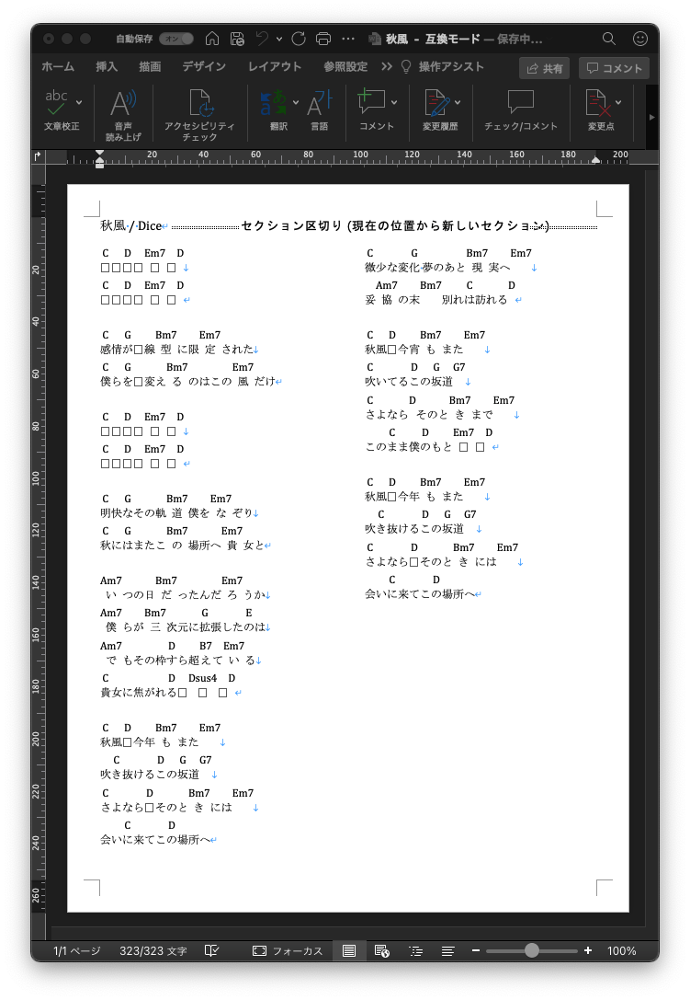

# About

- テキストの定義ファイルからMS Word形式のコード譜を作成します。

# Usage

```
usage: maker.py [-h] [-o OUT] [-t TRANSPOSE] [-s SONG] [-a ARTIST] [--flat] src

positional arguments:
  src                   コード、歌詞データファイル

optional arguments:
  -h, --help            show this help message and exit
  -o OUT, --out OUT     出力ファイル名
  -t TRANSPOSE, --transpose TRANSPOSE
                        移調
  -s SONG, --song SONG  曲名
  -a ARTIST, --artist ARTIST
                        アーティスト名
  --flat                移調の時に♭を使う
```

## Execution example

 ```
python maker.py -o "秋風 - Dice" -t 0 -s 秋風 -a Dice example/akikaze.txt
```

# Source format

```
chord:lyrics,chord:lyrics,chord:lyrics,...
```
- コードとそれに続く歌詞のペアをコロン（:）で区切って記述する。
- ペアはカンマ（,）で区切って記述する。
- 空行は段落の区切りを表す。

## Example

- 入力ファイル例

```
C:　,D:　,Em7:　,D:　
C:　,D:　,Em7:　,D:　

C:感情,G:が　線,Bm7:型に限,Em7:定された
C:僕ら,G:を　変え,Bm7:るのはこの,Em7:風だけ

C:　,D:　,Em7:　,D:　
C:　,D:　,Em7:　,D:　

C:明快,G:なその軌,Bm7:道僕を,Em7:なぞり
C:秋に,G:はまたこ,Bm7:の場所へ,Em7:貴女と

Am7:いつの日,Bm7:だったんだ,Em7:ろうか
Am7:僕らが,Bm7:三次元に,G:拡張した,E:のは
Am7:でもその枠,D:すら超,B7:えて,Em7:いる
C:貴女に焦がれ,D:る　,Dsus4:　,D:　

C:秋風,D:　今年,Bm7:もまた,Em7:　
吹,C:き抜ける,D:この,G:坂道,G7: 
C:さよなら,D:　そのと,Bm7:きには,Em7:　
会い,C:に来てこ,D:の場所へ

C:微少な変,G:化 夢のあと,Bm7:現実へ,Em7:　
妥,Am7:協の末,Bm7: 別れ,C:は訪れる,D:

C:秋風,D:　今宵,Bm7:もまた,Em7:　
C:吹いてる,D:この,G:坂道,G7:　
C:さよなら,D: そのと,Bm7:きまで,Em7:　
この,C:まま僕,D:のもと,Em7:　,D:　

C:秋風,D:　今年,Bm7:もまた,Em7:　
吹,C:き抜ける,D:この,G:坂道,G7: 
C:さよなら,D:　そのと,Bm7:きには,Em7:　
会い,C:に来てこ,D:の場所へ
```

- 出力ファイル



# Required packages

- python-docx